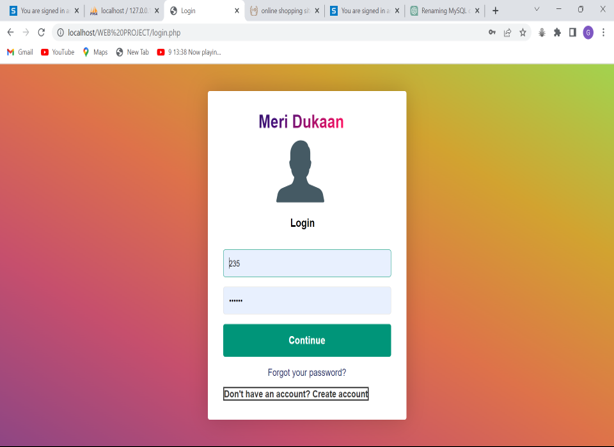

# Meri Dukan: Online Portal for Milk Delivery

Meri Dukan is an innovative web-based platform designed to modernize the traditional milk delivery system. It aims to reduce the time and effort required by customers and provide a reliable customer base for farmers. By leveraging modern web technologies and APIs, the project ensures a seamless and user-friendly experience.

## Features

**Customer Portal**:

- Easy registration and login for customers.
- Simplified order placement for milk delivery.
 - Real-time order tracking and management.

**Farmer Portal**:

- Registration and login for farmers to manage their milk supply.
- View customer orders and delivery schedules.

**Automated SMS Notifications:**

- Integrated Twilio API to send real-time SMS notifications for order confirmation, updates, and reminders.

**Database Management**:

- MySQL used for efficient storage and retrieval of customer, farmer, and order details.

**User-Friendly Interface**:

- Developed using HTML, CSS, and JavaScript to ensure an intuitive design.

## Tech Stack

**Frontend**:
HTML, CSS, JavaScript

**Backend**:PHP

**Database**:MySQL

**APIs:** Twilio API for  sending SMS notifications.

## Installation and Setup

**1.Clone the Repository:**

- git clone https://github.com/gauravai2025/E_commerce_website_milk_delivery.git

**2.Setup XAMPP:**

- Install XAMPP to configure Apache and MySQL.
- Place the project folder in the htdocs directory of your XAMPP installation.

**3.Database Configuration:**

- Import the meri_dukan.sql file (provided in the project) into your MySQL database using phpMyAdmin.
- Update the database connection details in the config.php file:

-<?php
$servername = "localhost";

$username = "root";

$password = "";

$dbname = "meri_dukan";
?> 

**4.Twilio API Configuration:**

- Sign up for a Twilio account and get your Account SID, Auth Token, and Phone Number.
- Update the Twilio API credentials in the twilio.php file

-<?php
require 'vendor/autoload.php';

-use Twilio\Rest\Client;

$sid = 'your_account_sid';

$token = 'your_auth_token';

$twilio_number = 'your_twilio_number';

$client = new Client($sid, $token);
?>

**5.Start the Application:**

- Start the Apache and MySQL services from the XAMPP control panel.
- Open a browser and go to http://localhost/meri-dukan.

    
## Usage

**1.Customers:**

- Sign up and log in to place orders for daily or weekly milk delivery.

- Receive SMS notifications for order confirmation and updates.

**2.Farmers:**

- Register to manage their milk supply and delivery schedules.

- View and confirm customer orders.

## Project Structure

- meri-dukan/
├── assets/         # Images, icons, and CSS files

├── config.php           # Database configuration

├── twilio.php           # Twilio API integration

├── login.php            # Login page for customers and farmers

├── register.php         # Registration page

├── order.php            # Order management page

├── README.md            # Project documentation

└── meri_dukan.sql       # Database schema

## Screenshots

## Future Enhancements

- Add payment gateway integration for online payments.

- Include analytics for farmers to track sales and earnings.

- Implement mobile application support for broader accessibility.

- Enable multilingual support.
